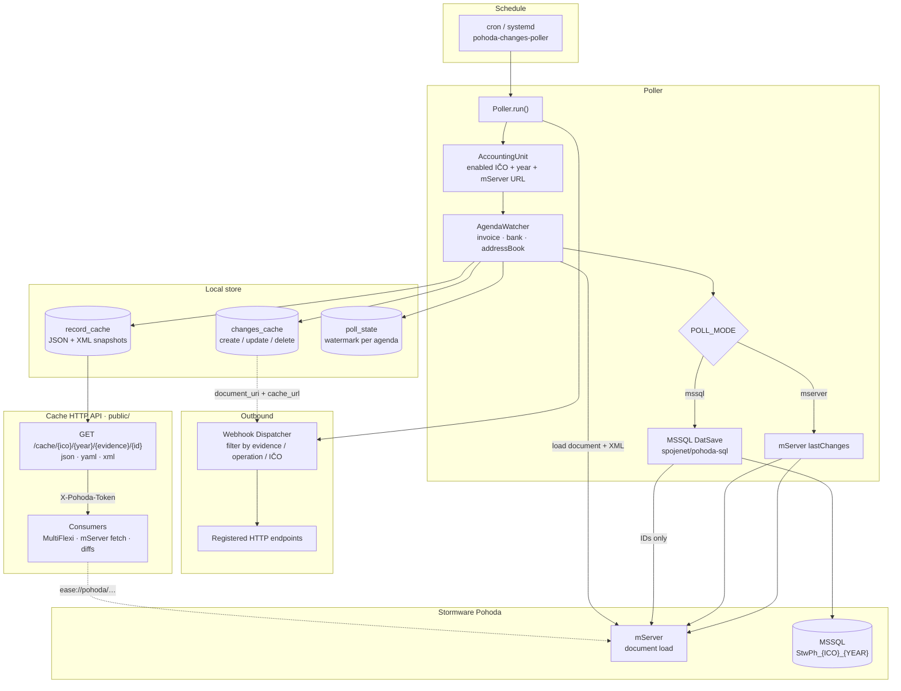

# Pohoda Changes API

Poll Stormware Pohoda (mServer `lastChanges`), store MultiFlexi-compatible `changes_cache` + document `record_cache`, and POST webhooks to registered endpoints.

## Features

- Multi accounting unit registry (`ico` + `year` + mServer `url`) — yearly DB `StwPh_{ico}_{year}`
- Two poll modes: **mServer `lastChanges`** (default — works for all Pohoda editions) or optional **MSSQL `DatSave`** when SQL is available (via [pohoda-sql](https://github.com/Spoje-NET/PohodaSQL)); documents always loaded from mServer
- Document snapshots for previous/current diffs and post-delete access
- Cache HTTP API: **json / yaml / xml** (Stormware XML via [pohodaser](https://github.com/VitexSoftware/php-vitexsoftware-pohodaser))
- Outbound webhooks with optional filters (`evidences`, `operations`, `icos`)

## How it works



**Cycle in short:** poller walks each accounting unit and agenda → discovers changed IDs (`mserver` = `lastChanges`, `mssql` = `DatSave` via [pohoda-sql](https://github.com/Spoje-NET/PohodaSQL)) → loads each document from **mServer** → stores snapshots in `record_cache` → appends `changes_cache` → POSTs matching webhooks.

### Poll modes

| Mode | Discovery | Document body | When to use |
|------|-----------|---------------|-------------|
| `mserver` (**default**) | mServer filter `lastChanges` | mServer | **All Pohoda editions** — many have no MSSQL; this is the only universal way to learn about new events |
| `mssql` (optional) | SQL `WHERE DatSave > watermark` on `FA` / `BV` / `AD` | mServer (only requested IDs) | SQL Server / higher editions where `StwPh_*` is reachable — cheaper discovery, less mServer list traffic |

**mServer polling is not removed and stays the default.** MSSQL mode is an opt-in optimization for deployments that already have SQL access; it never replaces mServer for loading document bodies.

Set globally with `POLL_MODE=mssql` or per unit (`poll_mode` / `unit-add --poll-mode=mssql`). MSSQL defaults: `POHODA_MSSQL_*` or per-unit `db_host` / `db_username` / … For a quiet first run use `POLL_MSSQL_SEED_ONLY=true` (stores `MAX(DatSave)` without exporting history).

## Quick start

```bash
cp .env.example .env
composer install
# configure DB_* in .env (sqlite works for smoke tests)
vendor/bin/phinx migrate -c phinx-adapter.php

bin/unit-add --ico=12345678 --year=2026 --url=http://10.11.25.23:40000
bin/webhook-add --url=https://example.com/hook --secret=s3cret
bin/pohoda-changes-poller
```

Point a web server at `public/` for the cache API.

### Cache API

```
GET /cache/{ico}/{year}/{evidence}/{recordid}
GET /cache/{ico}/{year}/{evidence}/{recordid}/previous
GET /cache/{ico}/{year}/{evidence}/{recordid}/history
GET /cache?document_uri=ease://pohoda/invoice?serverUrl=…&ico=…&year=2026#12345
```

Format: `?format=json|yaml|xml`, `Accept` header, or `.json` / `.yaml` / `.xml` suffix.  
Auth: header `X-Pohoda-Token` when `CACHE_API_TOKEN` is set.

### Webhook payload

```json
{
  "event": "webhook.change",
  "source_system": "pohoda",
  "source": 1,
  "evidence": "invoice",
  "operation": "create",
  "recordid": 12345,
  "inversion": 1726819200,
  "document_uri": "ease://pohoda/invoice?serverUrl=…&ico=12345678&year=2026#12345",
  "cache_url": "https://…/cache/12345678/2026/invoice/12345",
  "context": { "ico": "12345678", "year": 2026, "agenda": "invoice", "database": "StwPh_12345678_2026" }
}
```

## CLI

| Command | Purpose |
|---------|---------|
| `bin/unit-add` | Register IČO + year + mServer URL (+ optional MSSQL / poll-mode) |
| `bin/unit-list` | List units |
| `bin/unit-disable` | Disable/enable unit |
| `bin/unit-rollover` | Copy units from year A → B |
| `bin/webhook-add/list/disable` | Manage endpoints |
| `bin/pohoda-changes-poller` | One poll cycle |

## License

MIT
